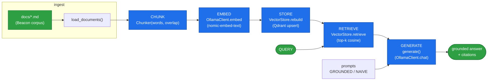
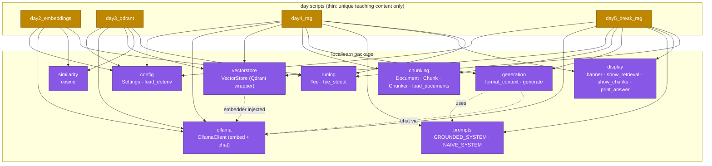
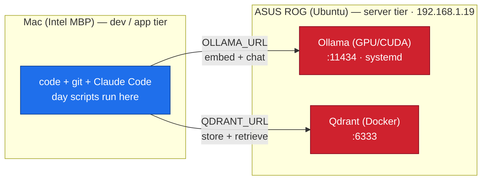

# LocalLearn — architecture & block flow

How the pieces fit together: the RAG **pipeline** (data flowing left→right), the
`locallearn` **modules** that own each stage, and the two-tier **rig** the code
runs against. The whole point of Day 4/5 is being able to point at *one* block and
say "the bug is here" — so the diagrams below are drawn stage-by-stage on purpose.

## 1. The RAG pipeline (data flow)

Each stage is a distinct block with exactly one job. A wrong answer is always
traceable to one of them — that taxonomy IS the Day-5 debugging lesson.

**The debugging seam:** everything up to and including `RETRIEVE` is *retrieval*;
`GENERATE` is *generation*. The first question on any wrong answer is "which half
failed?" — answerable only because `display.show_retrieval` prints the retrieved
chunks **before** the generated prose.

### Where each Day-5 break lands

| Break | Stage it breaks | Symptom |
|-------|-----------------|---------|
| #1 Chunking | `CHUNK` | table severed from its header; number survives, label lost |
| #2 Retrieval | `RETRIEVE` (k too small) | answer spans 2 chunks, k=1 returns half |
| #3 Hallucination | `GENERATE` (prompt) | out-of-corpus; guardrail on = refuse, off = invent |
| #4 Stale index | `STORE` (freshness) | docs edited but not re-embedded; index is a snapshot |

## 2. Module map (`locallearn` package)

Which file owns which block. Import the **module**, call it qualified
(`chunking.load_documents`) — the module name IS the source file.

**Key relationships**
- `VectorStore` takes the embedder as a **dependency** (`embedder=client`) — it
  never reaches for Ollama itself. That's the SOLID seam that lets Day 3 drive it
  at the raw-vector level and Day 4/5 at the text level.
- `generate()` is the only place `prompts` and `OllamaClient.chat` meet — swapping
  `GROUNDED` ↔ `NAIVE` there is the entire Day-5 hallucination experiment.
- `config.Settings` feeds URLs/models into everything; `runlog.tee_stdout` wraps
  every `main()` so each run self-logs to `result/dayN.txt`.

## 3. The rig (two-tier, deliberate client/server split)

Cross-machine state syncs **only** through `PROGRESS.md` + git — the client points
at the ASUS over the LAN via `OLLAMA_URL` / `QDRANT_URL` (in `.env`).
